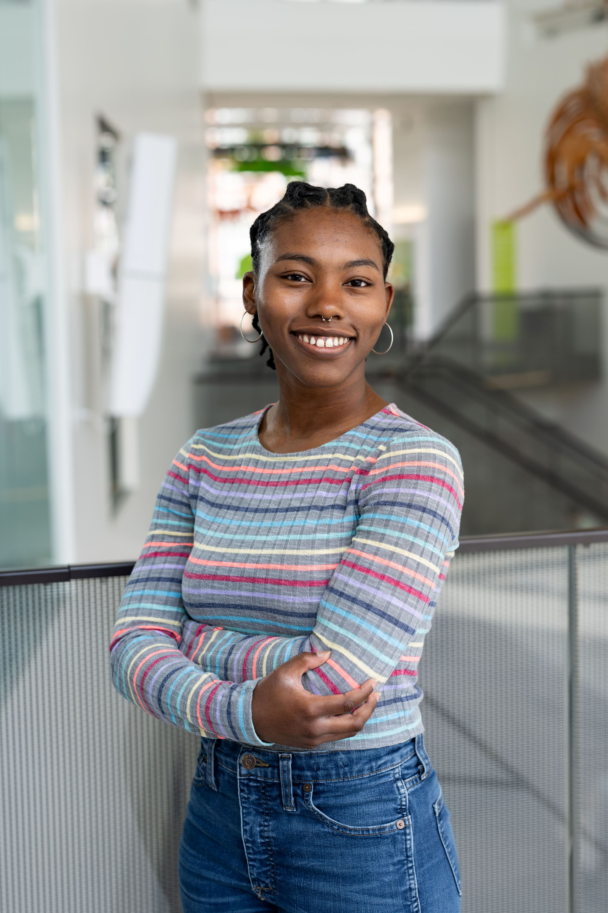

### Frontiers M.S. Student at the University of Michigan
### [Ecology & Evolutionary Biology](https://lsa.umich.edu/eeb/people/graduate-students/henrysam.html)

I am interested in organismal biology, evolution, conservation, and behavior.

---

## Education

I received my Associate of Arts degree at Valencia College (2019-2021), where I
focused on Biology.

Then I received my Bachelor of Science in Biology at the University of Central
Florida (2021-2023), where I focused on Zoology and Pre-Veterinary Science.
