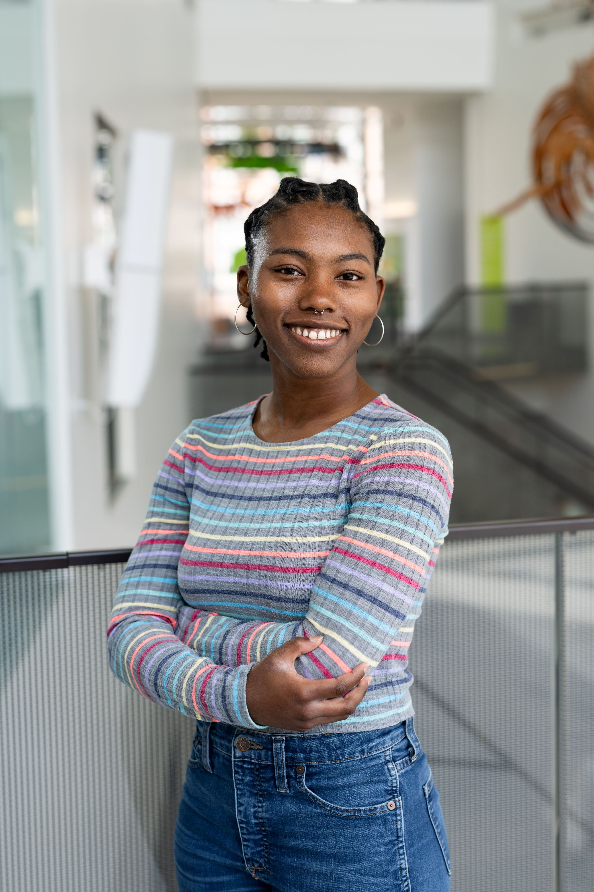
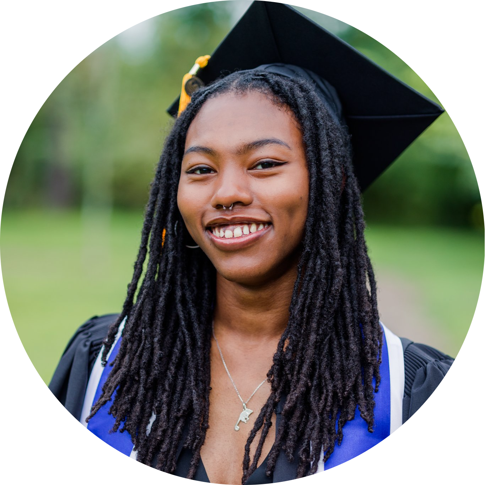

### Frontiers M.S. Student at the University of Michigan
### [Ecology & Evolutionary Biology](https://lsa.umich.edu/eeb/people/graduate-students/henrysam.html)

I am a **first-year master's student** interested in *organismal biology*, 
*evolution*, *conservation*, and *behavior*. I primarily study mammals, 
especially vulnerable species, and I hope to bridge the gap between academic 
research, museum collections, and zoos.

---

## Education

I received my Associate of Arts degree at **Valencia College** (2019-2021), 
where I focused on Biology.

Then, I received my Bachelor of Science in Biology at the 
**University of Central Florida** (2021-2023), where I focused on Zoology and 
Pre-Veterinary Science.

  

<a href="files/Samantha Henry CV.pdf" class="btn btn-default"> CV </a>

---
