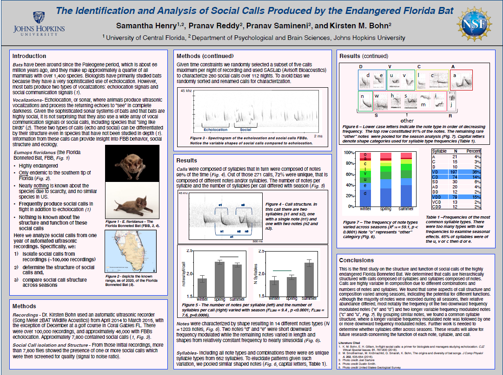

What better way to show my research throughout my academic journey then 
through *posters*!  
  
I wanted to become a veterinarian when I first entered college. So, in order 
to become competitive for veterinary school, I joined an organization
called the **Central Florida STEM Alliance** to get some research experience.
Although I wanted to study animals in my research project, the lack of
resources and the COVID-19 pandemic made it impossible. Instead, I decided to
complete a hydroponics project so I could get used to the scientific method.

The Central Florida STEM Alliance worked in tandem with the 
**Louis Stokes Alliance for Minority Participation (LSAMP)** program. Part of 
the program was that I would apply to an external research opportunity. By this 
time, I was still considering becoming a vet but also
becoming an animal behavior researcher. So, I applied to a few 
**Research Experiences for Undergraduates (REU)**, and got into the 
Biological Basis of Behavior REU at Johns Hopkins University. There, I learned 
about the power and versatility of Passive Acoustic Monitoring and how cool 
bats are!

After I transferred to the University of Central Florida, I wanted to continue
my research with bats or vocalization. However, I couldn't find any labs that
met that criteria. I was about to lose hope until I came across a presentation
from a new postdoc in the **Burnett Honors College**. It was a presentation to 
take a few students to Madagascar to work with lemurs for the summer. Sadly, I 
was unable to go to Madagascar, but I was able to work with the postdoc, 
Beatriz Otero Jiménez, to complete my Honors Undergraduate Thesis on lemur 
vocalizations.

I presented this poster at the **Ecological Society of America**'s 2023 
Annual Meeting.

<a href="https://stars.library.ucf.edu/honorstheses/1465/" class="btn btn-default"> Publications </a>

---